# GrowFlwr

**Federated irrigation advice without sharing farm data.**

Farms in one water region each hold telemetry they will not publish — soil
moisture, water drawn, yield. Individually, none of them has seen enough
conditions to know when irrigating is actually safe. Pooling the data is the
obvious fix and the one nobody will agree to.

GrowFlwr trains one model across all of them without moving a single row, then
puts a Flower Agent in front of it so a farmer can ask a plain question and get
a grounded answer.



## What it does

```
--- Farm 1 - sandy upland, canal head  [unusual] ---
weather: live forecast (open-meteo)
this farm alone:    safe to irrigate  ( 69% confident, 92.5% accuracy)
federated:          do not irrigate   ( 14% confident, 97.5% accuracy)
>>> THEY DISAGREE   correct answer: do not irrigate

Do not irrigate; the federated model gives this decision 14% confidence. Soil
moisture is 40.46%, and 12.19 mm of rain is forecast over 48 hours, both arguing
against irrigation. This farm's own model would have advised irrigating at 69%,
but the federated model learned from conditions this farm rarely sees.
```

The farm's own model would have wasted water on a field about to get 12mm of
rain. That is the case for federating, stated in litres.

## Results

Region-wide held-out accuracy, four farms, eight FedAvg rounds:

| farm | alone | federated | gain |
|---|---|---|---|
| Farm 1 — sandy upland, canal head | 92.5% | 97.5% | **+4.9pp** |
| Farm 2 — clay lowland, canal head | 97.0% | 97.5% | +0.5pp |
| Farm 3 — loam midslope, canal tail | 96.9% | 97.5% | +0.6pp |
| Farm 4 — terraced orchard, canal tail | 92.9% | 97.5% | **+4.5pp** |
| **mean** | **94.8%** | **97.5%** | **+2.6pp** |

Per farm per round, **64 bytes** of model weights crossed the wire. **1,920 rows
of raw telemetry stayed on the farms. Zero were transmitted.**

Read the gain honestly: federation rescues farms whose own history is narrow
(+4.9pp) and does little for a farm that already sees representative conditions
(+0.5pp). No configuration makes all four gain equally — that is a real property
of federated learning, not a defect in this build.

## Layout

```
federated/   Flower ServerApp + ClientApp — FedAvg across the farms
agent/       Flower AgentApp — answers the farmer, built on Flower's example
docs/        architecture diagram, build plan
scripts/     artifact sync, end-to-end demo
```

Two Flower projects, not one, because a FAB is **either** an AgentApp **or** a
ServerApp/ClientApp pair — `control_handlers.py:2156` branches on the presence of
an `agentapp` component and simulation is skipped for agent bundles.

## Run it

```bash
./scripts/demo.sh          # train, sync, then ask every farm
```

Or step by step:

```bash
cd federated && uv run flwr run . local-sim --stream   # ~23s, 8 rounds
cd .. && ./scripts/sync-model.sh                       # artifacts into the FAB
cd agent && uv run flwr login supergrid                # once
uv run flwr run . supergrid --stream
```

## How it holds together

**The model ships inside the FAB.** The AgentApp runs in a remote container
(`cwd=/app`) and cannot read the machine that trained it.

**Live weather goes through the platform's `web_fetch` connector.** Direct
outbound HTTP is blocked by an allowlisting egress proxy; `web_fetch` is the
sanctioned route. Three of the model's seven features come from the live
forecast, four from the farm's own sensors.

**Every number is computed before the model is called.** The LLM explains
figures, it does not produce them. A missing fact is reported as missing rather
than guessed at.

## Built on

[Flower](https://flower.ai) — `AgentApp` for the agent, `ServerApp`/`ClientApp`
with `FedAvg` for the training. The agent started as Flower's AgentApp example
and was edited in place.
